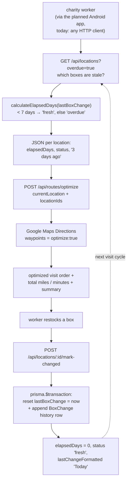

# Lost Children Charity Platform (CharityBusiness)

A platform for keeping charity **candy donation boxes** stocked: every location is a **timer**. The core stores one timestamp per location — `lastBoxChange` — and everything the platform reports (**elapsed days**, **fresh/overdue status**, "3 days ago") is *derived* from it on every read, never stored. A worker's one-tap **"Mark as Changed"** resets the timer and appends an immutable `BoxChange` history row in a single transaction; a **route optimizer** hands Google Maps Directions the day's stale locations and gets back the best visiting order with total miles and minutes.

The interesting part isn't the endpoints — it's the honest shape of the repo: of the four components laid out (`android/`, `backend/`, `web/`, `docs/`), **exactly one is implemented**. The entire working platform is **976 lines of TypeScript** in `web/`: a headless **Next.js 14 App Router** API with three endpoints, a controller, a **Prisma/PostgreSQL** schema, and **Zod** validation at every door. The Android client is a Gradle file with no Kotlin behind it, `backend/` is five empty directories, and the web UI is a ring of empty folders around a working API. This README documents what's real, what's scaffold, and where the sharp edges are.

---

## Table of Contents

1. [How the Timer Loop Works](#how-the-timer-loop-works)
2. [Repository Map](#repository-map)
3. [The Data Model](#the-data-model)
4. [The API Surface](#the-api-surface)
5. [Route Optimization](#route-optimization)
6. [The Planned Clients](#the-planned-clients)
7. [Build & Run](#build--run)
8. [Known Limitations & Sharp Edges](#known-limitations--sharp-edges)
9. [Provenance](#provenance)

---

## How the Timer Loop Works



Nothing ever writes a status to the database. The `locations` row keeps one timestamp; freshness, elapsed days, and the human-readable "1 week ago" are recomputed by [utils.ts](web/src/lib/utils.ts) on every read, so a location silently drifts from `fresh` to `overdue` at the 7-day mark with no cron job, no background worker, and nothing to get out of sync.

## Repository Map

```text
CharityBusiness-main/
├── README.md                     # you are here
├── SYSTEM-DESIGN.md              # the architecture-level view
├── FILELIST.txt                  # build artifact — 27,780-line recursive listing (incl. .git internals)
├── docs/
│   └── SECURITY.md               # key-handling policy (Google Maps, Stripe, keystores) —
│                                 #   written for a bigger platform than was built (no Stripe anywhere)
├── backend/                      # ⚠ five EMPTY directories: config/ controllers/ middleware/ models/ routes/
│                                 #   an Express-style scaffold; the real backend lives in web/src/app/api
├── android/                      # ⚠ Gradle config + manifest only — zero Kotlin source files
│   ├── build.gradle              # AGP 8.1.2, Kotlin 1.9.10, Compose 1.5.4, secrets-gradle-plugin
│   ├── app/build.gradle          # com.charity.lostchildren — SDK 24→34, Compose, Room, Retrofit, Maps
│   ├── app/src/main/AndroidManifest.xml   # permissions + .MainActivity (which doesn't exist)
│   ├── local.properties.example  # SDK path / Maps key / API base-URL template
│   └── {app/…}                   # ⚠ empty dirs from an unbalanced-brace mkdir -p — see sharp edges
└── web/                          # ✅ the implemented component: a headless Next.js 14 App Router API
    ├── package.json              # next / prisma / zod / @googlemaps — plus next-auth & zustand,
    │                             #   installed but never imported
    ├── prisma/schema.prisma      # 5 models: Location, BoxChange, Route, RouteStop, User (+ UserRole)
    ├── src/
    │   ├── app/api/
    │   │   ├── locations/route.ts                    # GET list (+ ?overdue=true) / POST create
    │   │   ├── locations/[id]/mark-changed/route.ts  # POST — the timer reset ("THE KEY FEATURE!")
    │   │   └── routes/optimize/route.ts              # POST — Google-optimized visiting order
    │   ├── lib/
    │   │   ├── controllers/locationController.ts     # all business logic (4 of 9 methods unwired)
    │   │   ├── db.ts                                 # PrismaClient singleton, dev-global cached
    │   │   └── utils.ts                              # elapsed-day math, Google Maps calls, error model
    │   ├── types/index.ts        # domain + API types, TIME_THRESHOLDS (7 / 14 days)
    │   └── app/analytics|auth|locations|routes, components/, hooks/, styles/   # ⚠ all empty — no UI
    ├── .env                      # ⚠ present with live-looking credentials — see sharp edges
    ├── env.example / env.example.template   # two generations of env templates
    ├── next.config.js            # still carries Next 13's experimental.appDir flag
    ├── tailwind.config.js        # charity color palette — no page or stylesheet uses it yet
    ├── tsconfig.json             # strict: false, "@/*" → src/*
    └── .next/                    # build artifact — dev-server output
```

## The Data Model

[schema.prisma](web/prisma/schema.prisma) defines five models, of which the first two do all the work:

- **`Location`** — name, address, `latitude`/`longitude` floats, optional contact person/phone/description/notes, `isActive` for soft deletes, and the load-bearing field: `lastBoxChange DateTime @default(now())`. Every status the platform reports is arithmetic on this one column.
- **`BoxChange`** — the append-only audit trail: `locationId`, `changedAt`, optional `changedBy`, `notes`, `boxCount`. Cascade-deletes with its location. A location's history is never edited, only appended.
- **`Route` / `RouteStop`** — a persisted-routes design (stop order, completion tracking, `@@unique([routeId, stopOrder])`) that **nothing ever writes**. The optimizer returns its result and forgets it.
- **`User` + `UserRole`** (`ADMIN`/`MANAGER`/`WORKER`) — an auth model with no auth system attached (see [sharp edges](#known-limitations--sharp-edges)).

[types/index.ts](web/src/types/index.ts) layers the derived vocabulary on top: `LocationResponse` adds `elapsedDays`, `status`, and `lastChangeFormatted` to the raw row, and `TIME_THRESHOLDS` pins the constants — `FRESH_THRESHOLD: 7`, `WARNING_THRESHOLD: 14`. Only the first is ever read: the code collapsed the planned three-state `fresh`/`warning`/`overdue` into two states, and `'warning'` survives only in the type unions.

## The API Surface

Three endpoints, each following the same shape: a **Zod schema** at the top of the route file, `schema.parse(body)`, a call into [`LocationController`](web/src/lib/controllers/locationController.ts), and a `{ success, data, message }` JSON envelope. Zod failures return 400 with the issue list; everything else flows through `handleApiError`, which sniffs Prisma error messages into 409 (`Unique constraint`) and 404 (`Record to update not found`).

| Endpoint | What it does |
|---|---|
| `GET /api/locations` (+ `?overdue=true`) | All active locations with `elapsedDays`, `status`, `lastChangeFormatted`, and the most recent `BoxChange`; the flag filters to overdue only |
| `POST /api/locations` | Create a location — name, address, lat (±90) / lng (±180), optional contact fields; timer starts fresh at creation |
| `POST /api/locations/:id/mark-changed` | The core feature: one `prisma.$transaction` resets `lastBoxChange` to now **and** appends a `BoxChange` row — both or neither |
| `POST /api/routes/optimize` | `{ currentLocation, locationIds[], returnToStart? }` → optimized visiting order, total miles/minutes, and a `"Current Location → A → B → …"` summary |

The controller holds more surface than the API exposes: `updateLocation`, `deleteLocation` (soft), `batchMarkBoxesChanged`, and `getLocationAnalytics` are fully implemented but **no route calls them** — location editing, deletion, and the analytics dashboard were built to the controller layer and stopped there.

## Route Optimization

[utils.ts](web/src/lib/utils.ts) wraps `@googlemaps/google-maps-services-js`. The optimize endpoint loads each requested location from the database, hands Google the *addresses* (not the coordinates), and asks for `directions` with `optimize: true` — which the client library serializes as the `waypoints=optimize:true|…` parameter, making Google solve the traveling-salesman ordering. The response's `waypoint_order` is mapped back to locations **by exact address string equality**, and total distance/duration are summed from each leg's *display text* (`"3.2 mi"`, `"8 mins"`) rather than the numeric meter/second values — a choice with teeth, see [sharp edges](#known-limitations--sharp-edges).

Also in the toolbox but never called from any route: a Distance Matrix wrapper (`calculateDrivingDistances`), a geocoder (`addressToCoordinates`), and a haversine fallback (`calculateStraightLineDistance`, Earth radius 3,959 mi).

## The Planned Clients

- **Android** ([android/](android/)) — a complete *build configuration* for `com.charity.lostchildren`: Kotlin 1.9.10, Jetpack Compose 1.5.4, Navigation, ViewModel, **Room** 2.6.1 for offline caching, **Retrofit** 2.9.0 for the REST calls, Maps Compose 2.15.0, and the secrets-gradle-plugin injecting `GOOGLE_MAPS_API_KEY` from `local.properties` into the manifest. What's missing is the app: there are **no Kotlin files, no `res/` directory, no `settings.gradle`, no Gradle wrapper**, and the manifest's `.MainActivity`, theme, icons, and backup-rules XMLs don't exist. The intended architecture is still legible in the accidental `{app/…}` directories: `ui/auth`, `ui/tracking`, `ui/distribution`, `ui/maps`, `data`, `domain`, `network`, `utils`.
- **Web UI** — `src/app/analytics`, `auth`, `locations`, `routes`, plus `components/`, `hooks/`, and `styles/` are all empty; there is **no `page.tsx` or `layout.tsx` anywhere**. Tailwind is configured with a `charity` palette that nothing renders. The Next.js app is an API server wearing a full-stack framework.
- **`backend/`** — `config/`, `controllers/`, `middleware/`, `models/`, `routes/`: five empty directories from an Express-era plan, superseded by the App Router API in `web/`.

## Build & Run

What you actually need: **Node.js 18+**, a **PostgreSQL 13+** database, and a **Google Maps API key** with the Directions API enabled. There is nothing to build in `android/` or `backend/`.

```bash
cd web
npm install

# configure — copy the template, fill in your own values
cp env.example .env          # DATABASE_URL, GOOGLE_MAPS_API_KEY, NEXTAUTH_SECRET

npm run db:generate          # prisma generate
npm run db:push              # push schema to the database (or db:migrate for migrations)
npm run dev                  # API at http://localhost:3000
```

Smoke-test it with any HTTP client — there is no UI and no seed data (`npm run db:seed` points at a `prisma/seed.ts` that doesn't exist), so the first location comes in by hand:

```bash
curl -X POST localhost:3000/api/locations -H 'Content-Type: application/json' \
  -d '{"name":"Downtown Food Bank","address":"123 Main St, Detroit, MI","latitude":42.3314,"longitude":-83.0458}'
curl localhost:3000/api/locations
curl -X POST localhost:3000/api/locations/<id>/mark-changed -H 'Content-Type: application/json' -d '{}'
```

`prisma studio` (`npm run db:studio`) is the closest thing to an admin UI. Deployment notes in the original docs assume Vercel + managed Postgres, with secrets set in the dashboard.

## Known Limitations & Sharp Edges

Honest notes — some are scope cuts, several are latent bugs, one is a security incident in waiting:

- **`web/.env` ships in the repo with real-looking credentials** — a Google Maps API key, a 64-hex `NEXTAUTH_SECRET`, and a Postgres password — despite `.gitignore` listing `**/.env` and [SECURITY.md](docs/SECURITY.md) existing specifically to prevent this. Treat every value in that file as burned: rotate the Maps key and use your own database credentials.
- **Anyone can do anything.** `next-auth` is installed, `NEXTAUTH_SECRET` is configured, and the `User`/`UserRole` model exists — but there is no NextAuth route, no session check, no middleware. All endpoints are unauthenticated writes.
- **`returnToStart` is cosmetic.** The Google request always sets `destination: origin`, so the route *always* returns to start and the totals always include the return leg; the flag only decides whether the summary string ends with "Current Location".
- **Distances are parsed from display text.** `parseFloat("3.2 mi")` works — but with imperial units Google reports short legs in feet, so `"528 ft"` parses as **528 miles**; and `parseInt` on `"1 hour 12 mins"` yields **1 minute**. Any trip with an hour-plus leg or a sub-0.1-mile hop reports garbage totals.
- **Address-equality mapping.** The optimized order is matched back to locations by `loc.address === address`; two locations sharing an address will both map to the first one.
- **`'warning'` is unreachable.** The three-state status type and the `WARNING_THRESHOLD: 14` constant survive in [types/index.ts](web/src/types/index.ts), but the logic is binary (`< 7` fresh, else overdue) and analytics hardcodes `warningCount: 0`. Comments claiming overdue means "> 14 days" are stale — it's ≥ 7.
- **An empty POST body 500s.** `mark-changed`'s fields are all optional, but `request.json()` throws on an empty body before Zod ever runs — send `{}` at minimum.
- **Half the controller is unwired.** `updateLocation`, `deleteLocation`, `batchMarkBoxesChanged`, `getLocationAnalytics` have no routes; `calculateDrivingDistances` is imported by the optimize route and never called. There is no way to edit or delete a location over HTTP.
- **`Route`/`RouteStop` are schema-only.** Optimized routes are never persisted; `getOverdueLocations` fetches *all* locations and filters in JS; `activeLocations` always equals `totalLocations` (the query already filters `isActive`).
- **The `android/{app` directories** are a shell accident: an `mkdir -p android/{app/src/main/java/com/charity/{…},app/src/main/res}` whose outer brace never expanded, leaving literal `{app` and `res}` directory names. Harmless, empty, and — together with the real empty package dirs `ui/locations` and `ui/toggle` under `android/app/src/main/java/com/charity/` — the fullest surviving record of the intended package layout.
- **Config drift** — `next.config.js` still sets Next 13's `experimental.appDir` (Next 14 warns about it) and plumbs a `CUSTOM_KEY` env var that is never defined; `tsconfig.json` has `strict: false`; the two env templates disagree on variable names (`GOOGLE_MAPS_API_KEY` vs `NEXT_PUBLIC_GOOGLE_MAPS_API_KEY`); `FILELIST.txt` and `web/.next/` are build debris in the tree.
- **No tests.** Not one — see the [verification section of SYSTEM-DESIGN.md](SYSTEM-DESIGN.md#verification--testing-status).

## Provenance

A solo project — no teammates, course, or organization is credited anywhere in the repository, and the original README credits only its solo author, pitching the planned platform (vision, market potential, copyright) around the same stack. Judged by content, all TypeScript in [web/src/](web/src) is project-authored (the only generated file is `next-env.d.ts`); the Android Gradle files and manifest are standard Android Studio-shaped configuration authored for a client that was never started; [docs/SECURITY.md](docs/SECURITY.md) is project-authored policy. Third-party foundations: **Next.js 14**, **Prisma 5**, **Zod**, **@googlemaps/google-maps-services-js**, **date-fns**, and **Tailwind** (config only). GitHub: [KuyaBasti/CharityBusiness](https://github.com/KuyaBasti/CharityBusiness).

See [SYSTEM-DESIGN.md](SYSTEM-DESIGN.md) for the architecture-level view: the full data-flow diagram, the ideas behind the design, and the numbers that matter.
