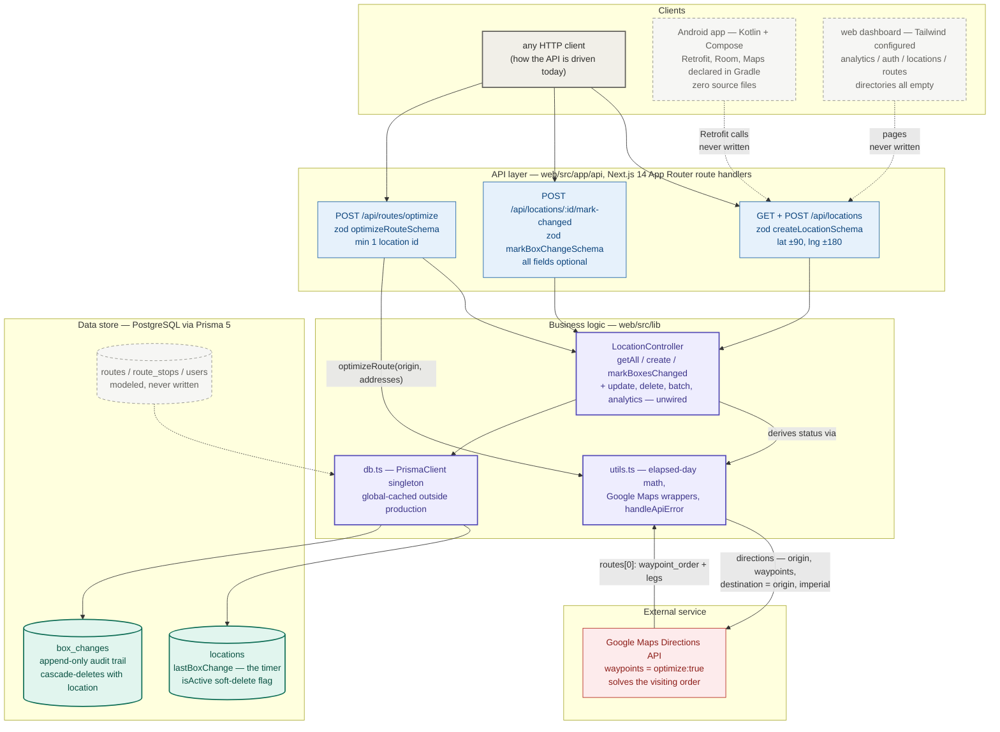
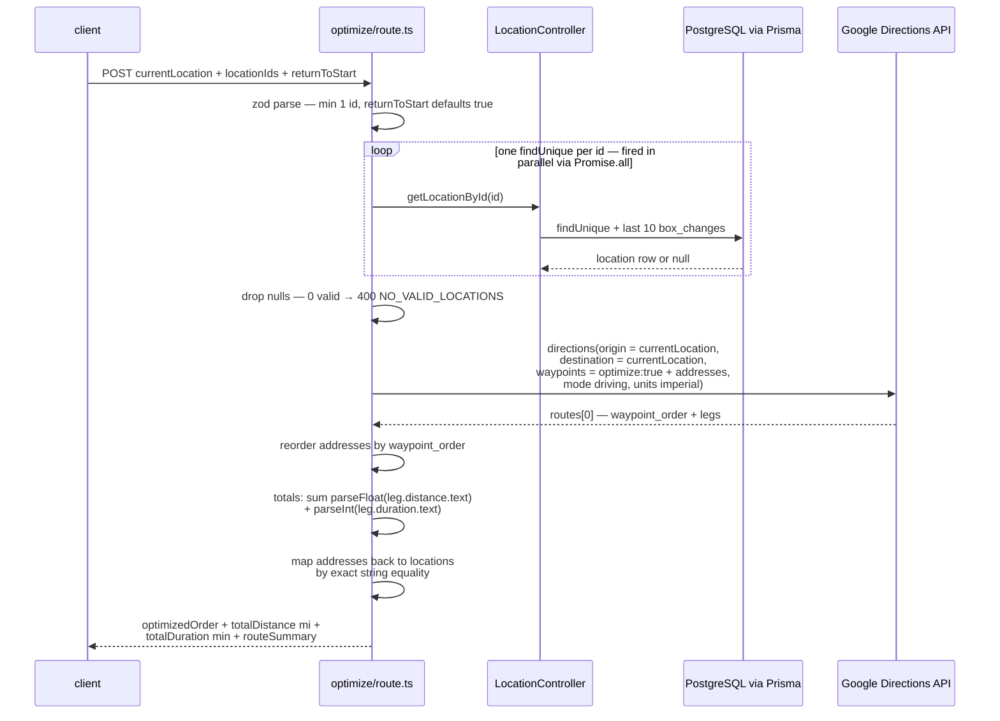

# Lost Children Charity Platform — system design

> Every location is a clock that only moves forward.
>
> The database stores a single fact per candy box location — when it was last
> restocked — and the platform's entire vocabulary (**elapsed days**, **fresh**,
> **overdue**, *"3 days ago"*) is recomputed from that one timestamp on every
> read. Nothing stores a status, so nothing can get out of sync. A worker's tap
> resets the clock and appends one immutable history row in a single
> transaction; the traveling-salesman problem of visiting the stale boxes is
> handed, whole, to **Google's Directions API**. Around this working core stand
> the outlines of the platform it was meant to become — an Android client, a
> web dashboard, an auth layer — present as directories, dependencies, and
> schema, but not yet as code.

This document is the developer-facing map of the whole system — every component
and how data moves between them. The companion [README](README.md) covers the
per-layer detail, building, and running.

---

## End-to-end flowchart



**Legend** — ⬜ clients · 🟦 API route handlers · 🟪 business logic ·
🟩 live tables · 🟥 external service ·
◌ dashed = declared but not built (the Android app, the web UI, the dormant
tables, and all three dashed arrows).

---

## How to read it: the three ideas that matter

1. **Status is derived, never stored.** The only mutable state in the whole
   system is `locations.lastBoxChange` (plus the rows that history appends).
   `elapsedDays`, the `fresh`/`overdue` status, and the human string
   *"1 week ago"* are computed by `calculateElapsedDays` on every read —
   `floor((now − lastBoxChange) / 86,400,000 ms)`, compared against a 7-day
   threshold. That means a box drifts into `overdue` with no cron job, no
   background worker, and no denormalized column to forget to update; the
   read path *is* the state machine. The price is that every consumer gets
   status only by asking, and "overdue" queries can't be pushed into SQL —
   `getOverdueLocations` fetches everything and filters in JS.

2. **One Next.js app is the whole backend — and the routes are the real
   bottleneck of what exists.** Each route file follows the same discipline:
   a Zod schema at the top, `schema.parse(body)`, a call into
   `LocationController`, a `{ success, data, message }` envelope, and a
   two-tier error path (Zod issues → 400; everything else → `handleApiError`,
   which pattern-matches Prisma's message strings into 409/404/500). The
   controller beneath is *wider* than the API above it — update, soft-delete,
   batch mark-changed, and analytics are fully implemented and unreachable —
   so the honest system boundary is the three route files, not the
   controller's method list. The `backend/` directory tree (an Express-era
   plan) lost to this design and was left as five empty folders.

3. **The hard problems are outsourced or postponed.** Route ordering goes to
   Google — the client library turns `optimize: true` into the
   `waypoints=optimize:true|…` parameter and Google returns `waypoint_order`;
   the project's own contribution is the id → address → Google → address → id
   round-trip and the summary arithmetic. Authentication is postponed:
   `next-auth` is installed, its secret is configured, `User`/`UserRole` are
   modeled, and no request is ever checked. Route persistence is postponed:
   `Route`/`RouteStop` tables exist and nothing writes them. The system that
   runs is exactly the timer loop — list, optimize, visit, reset.

---

## Deep dive 1 — one optimize call, end to end

`POST /api/routes/optimize` is the most involved flow in the system: the only
endpoint that touches the database *and* the outside world.



Things worth noticing:

- **Google always routes a loop.** `destination` is hardcoded to the origin,
  so with N waypoints the response has N+1 legs and the totals always include
  the drive home. The validated `returnToStart` flag only decides whether the
  summary string gets a trailing "Current Location" — it never reaches the
  Google request.
- **The totals are parsed from display text.** `"3.2 mi"` → 3.2 works;
  `"528 ft"` (imperial short legs) → 528 *miles*, and `"1 hour 12 mins"` →
  `parseInt("1 hour 12")` → **1 minute**. The API response carries numeric
  meter/second values that would make this exact; the code reads the strings.
- **Addresses are the join key.** Locations go to Google as address strings
  and come back matched by `loc.address === address` — two stops sharing an
  address collapse onto the first.

## Deep dive 2 — the timer, and the transaction that resets it

```text
   locations row (stored)                derived on EVERY read (never stored)
   ┌───────────────────────────┐         ┌─────────────────────────────────────┐
   │ lastBoxChange ────────────┼────────►│ elapsedDays = floor(Δms / 86.4M)    │
   │   the single load-bearing │         │ status      = days < 7 ? 'fresh'    │
   │   timestamp               │         │                        : 'overdue'  │
   │ isActive (soft delete)    │         │ formatted   = "Today" / "1 day ago" │
   │ box_changes ──────────────┼──┐      │             / "3 days ago"          │
   └───────────────────────────┘  │      │             / "1 week ago"          │
                                  │      └─────────────────────────────────────┘
                                  ▼
   POST /api/locations/:id/mark-changed
   └─ prisma.$transaction([
        location.update  { lastBoxChange: now, updatedAt: now },
        boxChange.create { locationId, changedAt: now,
                           changedBy?, notes?, boxCount? }
      ])   ← both or neither: the timer never resets without a history row
```

- **The transaction is the contract.** The timer column and the audit trail
  are updated atomically, so `lastBoxChange` always has a matching
  `box_changes` row (creation is the one exception: a new location starts
  fresh with no history). `batchMarkBoxesChanged` extends the same shape with
  `updateMany` + `createMany` — implemented, tested by no one, exposed
  nowhere.
- **Listing is history-light, detail is history-deep.** `getAllLocations`
  includes only the single most recent `BoxChange` per location
  (`take: 1`, newest first); `getLocationById` — used by the optimizer —
  pulls the last 10.
- **The formatted string has a gap by design.** Days 7–13 render as weeks
  ("1 week ago") and everything from 14 up falls back to raw
  "`N` days ago" — the week formatting only ever produces "1 week ago"
  because `weeks = floor(days/7)` is computed under a `days < 14` guard.

---

## Component inventory

| Component | Layer | Provenance | Where |
|---|---|---|---|
| Prisma schema — 5 models + `UserRole` | Data | ✅ implemented here | [schema.prisma](web/prisma/schema.prisma) |
| Prisma client singleton | Data | ✅ implemented here (standard pattern) | [db.ts](web/src/lib/db.ts) |
| Domain + API types, `TIME_THRESHOLDS` | Types | ✅ implemented here | [types/index.ts](web/src/types/index.ts) |
| `LocationController` — all business logic | Logic | ✅ implemented (4 of 9 methods unwired) | [locationController.ts](web/src/lib/controllers/locationController.ts) |
| Elapsed-time math, Maps wrappers, error model | Logic | ✅ implemented (5 helpers never called) | [utils.ts](web/src/lib/utils.ts) |
| Locations list/create route | API | ✅ implemented here | [locations/route.ts](web/src/app/api/locations/route.ts) |
| Mark-changed route | API | ✅ implemented here | [mark-changed/route.ts](web/src/app/api/locations/%5Bid%5D/mark-changed/route.ts) |
| Route-optimize route | API | ✅ implemented here | [optimize/route.ts](web/src/app/api/routes/optimize/route.ts) |
| Next/Tailwind/TS configuration | Build | ✅ hand-written config | [next.config.js](web/next.config.js) · [tailwind.config.js](web/tailwind.config.js) · [tsconfig.json](web/tsconfig.json) |
| Security policy | Docs | ✅ written here (broader than the code) | [SECURITY.md](docs/SECURITY.md) |
| Google Maps services client, Prisma, Zod, date-fns | Vendored | third-party npm | [package.json](web/package.json) |
| Android build config + manifest | Mobile | ⬜ config only — zero Kotlin | [android/](android/) |
| Web UI (pages, components, hooks, styles) | Frontend | ⬜ empty directories | [web/src/](web/src) |
| Express-style backend | — | ⬜ five empty directories | [backend/](backend/) |
| Auth (`next-auth`, `User` model, secret) | — | ⬜ installed, modeled, unwired | [package.json](web/package.json) · [schema.prisma](web/prisma/schema.prisma) |

---

## The numbers that matter

| Value | What it is |
|---|---|
| 7 days | `FRESH_THRESHOLD` — below it a location is `fresh`, at or above it `overdue` |
| 14 days | `WARNING_THRESHOLD` — defined, exported, never read; `'warning'` is unreachable |
| 1 / 10 | `BoxChange` rows fetched per location: listing (`take: 1`) vs detail (`take: 10`) |
| 3 | HTTP endpoints (4 handlers: GET+POST locations, POST mark-changed, POST optimize) |
| 976 | lines of TypeScript in `web/src` — the entire implemented platform |
| 5 + 1 | Prisma models + enum; 2 tables are ever written (`locations`, `box_changes`) |
| ±90 / ±180 | Zod bounds on latitude / longitude, re-checked by `isValidCoordinates` |
| 3,959 mi | Earth radius in the haversine fallback (implemented, never called) |
| N + 1 | legs in every optimize response — `destination: origin` always adds the return leg |
| 400 / 404 / 409 / 503 / 500 | error statuses: Zod, "Record to update not found", "Unique constraint", Maps failure, everything else |
| 3000 | dev-server port; the Android template points `API_BASE_URL` at `localhost:3000/api` |
| 24 → 34 | Android min → compile/target SDK (Kotlin 1.9.10, Compose 1.5.4, AGP 8.1.2) |
| 0 | Kotlin files, web pages, tests, and auth checks |
| 27,780 | lines in `FILELIST.txt`, the stray recursive directory listing at the repo root |

---

## Verification / testing status

**There are no tests.** No test directory, no test runner in
[package.json](web/package.json) (the closest is `type-check`, a bare
`tsc --noEmit`), no CI configuration, and no seed data — `npm run db:seed`
points at a `prisma/seed.ts` that does not exist. The `web/.next/` directory
contains development-server output, which is the only executable evidence in
the tree that the API was actually run; validation was evidently manual,
against a hand-populated database, in the style of the example request bodies
that the route files carry in their doc comments. The sharpest consequences:
the text-parsing bugs in the optimizer's totals and the empty-body 500 on
`mark-changed` are exactly the kind of edge a first integration test would
have caught.

---

## Design trade-offs & sharp edges

- **Derived status over stored status** — nothing to sync, no background
  jobs, and the 7-day boundary is crossed "for free" on the next read; in
  exchange, overdue filtering happens in JS over the full table, and every
  client pays the computation on every request. At this system's scale
  (a charity's box locations) the trade is clearly right.
- **Address strings over coordinates as the Google interface** — human-legible
  requests and no geocoding step, but it makes the address field a *join key*
  (exact-equality mapping back from `waypoint_order`) and leaves the stored
  `latitude`/`longitude` — validated at creation to ±90/±180 — unused by the
  optimizer. The geocoder that would bridge the two exists in
  [utils.ts](web/src/lib/utils.ts) and is never called.
- **Display-text parsing over numeric fields** — the legs' `distance.value` /
  `duration.value` (meters/seconds) are available in the same response the
  code already holds; parsing `"3.2 mi"` instead breaks on feet (`"528 ft"` →
  528 mi) and on hours (`"1 hour 12 mins"` → 1 min). This is the system's
  most consequential latent bug.
- **A wide controller behind a narrow API** — building update/delete/batch/
  analytics logic before their routes made the controller a complete
  statement of intent, but it means the deployed system cannot edit or delete
  a location, and dead surface (plus `calculateDrivingDistances`, imported
  and unused) reads as live.
- **Secrets hygiene preached, not practiced** — [SECURITY.md](docs/SECURITY.md)
  and a thorough `.gitignore` both target exactly the mistake the repo ships:
  `web/.env` with a live-looking Maps key, NextAuth secret, and database
  password. Rotate before any deployment.
- **Scaffold as roadmap** — the empty `backend/` tree, the source-less Android
  Gradle build (which cannot compile: no `settings.gradle`, no wrapper, no
  `MainActivity`, no `res/`), the empty UI directories, and the dormant
  `Route`/`RouteStop`/`User` tables are all *declared intent*. They document
  the plan honestly, at the cost of a repo where most directories are
  load-bearing only in spirit — including the literal `{app/…}` directories
  left by an unbalanced-brace `mkdir -p`, whose names (plus two real empty
  package dirs, `ui/locations` and `ui/toggle`, under `java/com/charity/`)
  are the fullest surviving spec of the Android package layout.

---

## Provenance

A solo project — no teammates, course, or organization is credited anywhere
in the repository. Judged by file content: all TypeScript under
[web/src/](web/src), the Prisma schema, the Android Gradle/manifest
configuration, and [docs/SECURITY.md](docs/SECURITY.md) are project-authored
(the only generated file is `next-env.d.ts`; there is no starter-kit
boilerplate beyond what `create-next-app`-era conventions suggest). Built on
**Next.js 14**, **Prisma 5**, **Zod**, **@googlemaps/google-maps-services-js**,
**date-fns**, and **Tailwind** (config only), with the planned Android client
specified against **Jetpack Compose**, **Retrofit**, and **Room**. GitHub:
[KuyaBasti/CharityBusiness](https://github.com/KuyaBasti/CharityBusiness).
